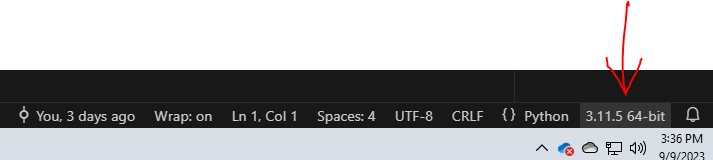

# Setting up your development environment for CSE 251

- [ ] [Install Visual Studio Code IDE](#install-vscode)
- [ ] [Remove old Python](#remove-old-versions-of-python)
- [ ] [Install Python](#install-python)
- [ ] [Install Python Modules](#install-modules)
- [ ] [Install Git](#install-git)
- [ ] [Configure Environment](#configure-env)

## <a name="install-vscode">Install Visual Studio Code IDE
There are a number of IDEs [Integrated Development Environments](https://en.wikipedia.org/wiki/Integrated_development_environment) available to programmers. You are free to use any editor that you want.  However, the course will use Visual Studio Code as the editor in video examples and during class time.  VSCode can be downloaded at [VSCode](https://code.visualstudio.com).

## Remove old versions of Python
See [remove old versions of Python](remove-old-versions-of-python.md)

### Packages to install in VSCode 

Within VS Code, click on Extensions:


Then search for Python and install the Microsoft one (it will have millions of downloads). This is not the same Python that you will use to run your code. This extension will enable the VS Code IDE to offer feedback as you type your code. One of the benefits of typing your code in an IDE is that it can help you with code completion, show errors before you run your code, documentation, and code navigation. 

## <a name="install-python"></a>**Install Python**
We will be using Python throughout the course. Python can be [downloaded here](https://python.org/downloads). This semester we will be using [python-version](python-version.md).

Python needs to be installed on your computer (separate from installing Python in VS Code). After you install Python on your computer, open a terminal (command prompt) 
and type either `py --version` or `python3 --version` (this should show you the version that you installed). 



You want to use this version of Python when you press the RUN button in VS Code. To make this happen, in VS Code, press Ctrl+3 (if you are on a Mac, go to Help and click 'Show All Commands'). Then type "Python: Select Interpreter":


Select the version of Python that you downloaded. VS Code will recommend that you use the Microsoft version, but it is old:


## <a name="install-modules"></a> **Install Python Modules**
In this class, we will be using some modules/packages that do not come installed by default with the base Python install. To install modules/packages in python, we will use an app called 'pip' (see https://www.w3schools.com/python/python_pip.asp). 

### Install pip
Open a terminal inside of VS Code and check if you have pip installed by typing:
>pip --version
(Note: mac users may need to type pip3)

https://phoenixnap.com/kb/install-pip-mac

If it doesn't recognize what "pip" is than install pip:
Windows --> https://www.geeksforgeeks.org/how-to-install-pip-on-windows/
Mac --> https://phoenixnap.com/kb/install-pip-mac

### Install necessary modules using pip
From a terminal inside of VS Code, type:
>py -m pip install \<name of the module shown below\>

The following modules/packages need to be installed for use in our CSE251 class:
1. requests 
2. numpy
3. matplotlib
4. Pillow
5. opencv-python

## <a name="install-git"></a> **Install Git**
Git comes preinstalled with your VS Code. You need to clone our class repo. If you are reading this page in a browser, then you are inside of the the class repo. To clone it, go to the top most directory of the repo and click on the repo name in the breadcrumb and then click the "Code" button to get a copy of the repo path, use the HTTPS link.

You would then open a terminal in VS Code (using cd, navigate to where you want to clone the repo) and type:
git clone https://github.com/brandonfoushee/cse251.git  (or paste in the link that you copied)

This will create a cse251 directory in the directory in which you are in. 

Now you have all the files for the class.

## <a name="configure-env"></a> **Configure Environment**

Configure your Python environment in VS Code to:
1. Find the [cse251function.py](../../resources/cse251functions.py) file. This file is located in the resources directory.
2. Use the active directory as your Current Working Directory (cwd).

### cse251function.py file ###
The Python Interpretor uses a property called `PYTHONPATH`. This property defines a list of directories to search through to resolve imports. You will add the absolute path to your resource/cse251function.py file. To do this:
1. Right click on the resource/cse251function.py file in VS Code. 
2. Select `Copy Path`.
3. Open the `.env` file (in your workspace root directory---scroll to the bottom after week13 in VS Code).
4. Paste the path after PYTHONPATH=, removing the text in-between <>, including the <> symbols.
5. Remove the 'cse251function.py' at the end.
6. Save

Example: `PYTHONPATH=c:/Users/bfous/Documents/workspace/cse251/resources`

### Set Current Working Directory (cwd) ###
When you run a Python file in VS Code, it will resolve paths to directory or files looking in your Current Working Directory (cwd). By default, the cwd is your workspace. Your workspace is the Git repo that you cloned. So, if you look in the Explorer and scroll up (above week01, resources, and .vscode) you will see the workspace is called 'CSE251'. 

If code tries to open a file, like this:
```
with open("data.txt", "r") as f:
```
Python will look in your CSE251 directory. If the file is in the same directory as the file containing the above code (the file you ran to execute that code), then you will get a File Not Found error. 

For this class, we want Python to look in the same directory as your assignment files. To do this we want to change the cwd to be the same directory as the file you are executing/running.

To set your cwd to be the same directory as the executing/running file:
1. Open [.vscode/launch.json](../../.vscode/launch.json).
2. Verify that the following text is in the launch.json file:
```
{
    "configurations": [
        {
            "name": "Python",
            "type": "debugpy",
            "request": "launch",
            "program": "${file}",
            "console": "integratedTerminal",
            "cwd": "${fileDirname}"
        }
    ],
}
```
**Note:** 
The "Run" button (in the top right corner of VS Code) is an extension and not part of VS Code. It will not run your Python code using the launch.json file. Thus, if you use the button, it will NOT change your cwd and files will not be found. 

**<span style="color:red;font-size:25px">Don't use the Run button.</span>** 

Instead, use the built-in VS Code Run->Run Without Debugging option. The shortcut on Windows is Ctrl-F11.