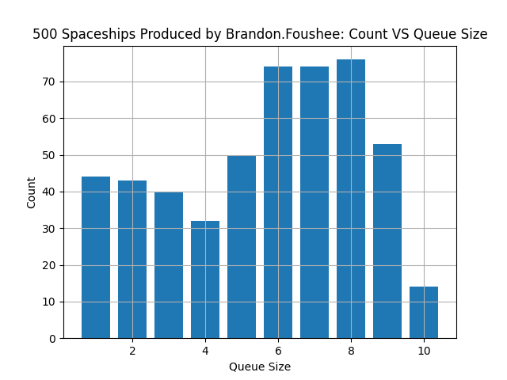

# 05 Prove: SpaceShipFactory and SpaceShipBuyer

## Overview

You will be using queue(s) and thread semaphore(s) to synchronize two threads in the production and selling of spaceships.

## Project Description

This assignment will contain two threaded classes. A `SpaceShipFactory` will create spaceships and a `SpaceShipBuyer` will retrieve them. There is a limit on the number of spaceships that a buyer can handle at a time. This is the `MAX_QUEUE_SIZE` variable. Therefore, if the buyer is full of spaceships, the factory must wait before producing more spaceships.

## Assignment

The Python file contains the following classes:

**SpaceShip**: This is the spaceship that the SpaceShipFactory will create.  When a spaceship is created, it randomly selects a make, model and year.

**SpaceShipFactory**: This threaded class creates the spaceships for the SpaceShipBuyer.  After a spaceship is created, the factory uses a short delay between creating another one.

**SpaceShipBuyer**: This buyer buys spaceships created by the SpaceShipFactory. After a spaceship is received, the buyer uses a short delay before retreiving another. The buyer only has room for 10 spaceships, therefore, if the buyer is full, the factory must wait until a spaceship is flown away before creating another.

**NonBlockingQueue**: This is a queue that must be used in the assignment. It has no internal locks and therefore does not block. This class should not be modified

## Instructions

- Download the [assignment.py](assignment.py) file.
- Implement your code where the TODO comments are found.
- No global variables, all data must be passed to the objects.
- You are not allowed to use the normal Python Queue class.  You must use the NonBlockingQueue class. This shared queue holds the SpaceShip objects and can not be greater than MAX_QUEUE_SIZE while your program is running.
- Your goal is to create `spaceships_to_produce` many spaceships. The buyer thread must not know how many spaceships will be produced by the manufacturer.
- You will need two semaphores to properly implement this assignment.  Don't use a BoundedSemaphore. Do not use any arguments for the method acquire() when using semaphores.  Also, when using semaphores, do not use the **_value** attribute.

### Plot created by your program.  

**AFTER** the SpaceShipBuyer takes a spaceship from the queue, it uses `size()` to get the size of the queue and updates the `buyer_stats` list.  Here is an example of a plot (Your plot might/will look different).  Each bar represents the size of the queue while the program is running. 

## Rubric

Item | Point Value
--- | ---
Runs without errors | 30
Semaphore used to control queue size | 20
Semaphore used to control reading empty queue | 20
Queue size not used in IF statement | 5
Plot of spaceship count vs queue size | 15
Sentinel correctly sent from factory to buyer | 10

Assignments are not accepted late. Instead, you should submit what you have completed by the due date for partial credit.

Assignments are individual and not team based.  Any assignments found to be plagiarized will be graded according to the `ACADEMIC HONESTY` section in the syllabus. Personalize your code by adding comments explaining how your code works. This provides evidence that you wrote it yourself. You are allowed to work with other students, but your comments need to be in your own words.

## Submission

When finished, upload your assignment.py and signature files to Canvas (no zip files).
